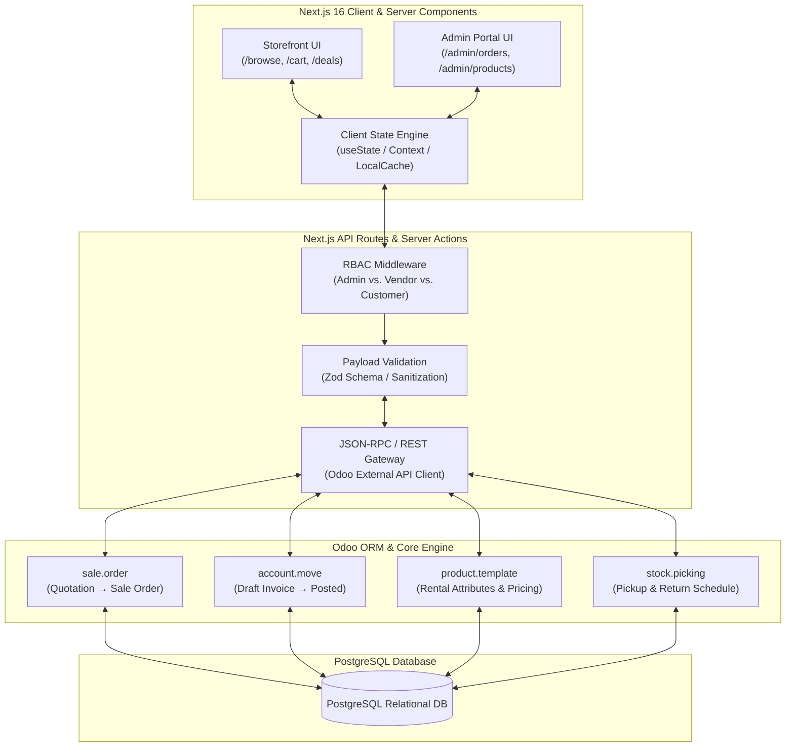
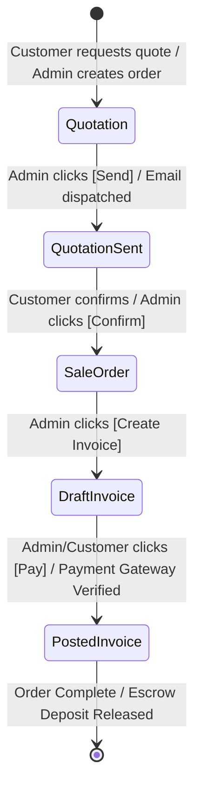

# 🏗️ LuxRent Rental Management Platform — Backend Architecture Blueprint & Presentation Script

This document details the complete backend architecture, database schemas, state machine transitions, API data flows, role segregation, and verbatim presentation script for the **Odoo Hackathon**.

---

## 📊 PART 1: SYSTEM TOPOLOGY & ARCHITECTURE DIAGRAM



---

## 📜 PART 2: DESCRIPTIVE ARCHITECTURE BREAKDOWN (MODULAR SCRIPT)

### **Module 1: Data Models & Odoo ORM Mapping (Relational Schema)**
> *"At the core of the LuxRent backend is a highly structured, relational database schema built on **Odoo’s Object-Relational Mapping (ORM)** over **PostgreSQL**. Instead of treating rental items as simple e-commerce products, we extend Odoo’s native models to support time-series booking, security deposits, and multi-tier corporate pricing."*

#### **Key Entity Mappings (`PostgreSQL / Odoo Models`)**
1. **`product.template` & `product.product` (Equipment & Variants)**
   * **Attributes (`product.attribute`)**: Maps directly to our UI display swatches (`Radio`, `Pills`, `Dropdown`, and `Color Swatch` display types such as `Size`, `Attachment Kit`, `Brand`).
   * **Rental Pricing (`sale.temporal.recurrence`)**: Stores daily, weekly (-15%), and monthly corporate tier rates (-30%) alongside minimum booking duration constraints (`min_days`).
   * **Late Fee Rules (`luxrent.late.fee`)**: Custom model linking hourly penalty percentages to equipment categories and customer deposits.

2. **`sale.order` & `sale.order.line` (Rental Orders & Quotations)**
   * Tracks customer billing profiles (`partner_id`), delivery coordinates, and exact rental start/end timestamps (`pickup_date`, `return_date`).
   * **Order Lines (`sale.order.line`)**: Computes `quantity × duration × unit_rate` with dynamic tax calculation (`18% GST`) and automated security deposit itemization.

3. **`account.move` & `account.move.line` (Financial Ledger & Invoicing)**
   * Orchestrates the financial lifecycle. Links directly to the `sale.order` (`invoice_ids`) to guarantee zero double-billing and automated escrow holding for security deposits.

---

### **Module 2: State Machine & Lifecycle Transitions (Workflow Engine)**
> *"The backbone of our business logic is an event-driven **Finite State Machine (FSM)**. Every order and invoice undergoes strict, immutable state transitions triggered by user actions in the frontend steppers, ensuring complete auditability."*



#### **Detailed State Rules:**
* **`Quotation` (`draft`)**: Order is created. Inventory availability is checked for date conflicts across all active bookings, but stock is not yet hard-reserved.
* **`Quotation Sent` (`sent`)**: Triggered when the quotation document is dispatched via email or shared link. The system locks the price list against sudden rate changes for the duration of the quotation validity (`30 days`).
* **`Sale Order` (`sale`)**: Triggered when confirmed by the customer or operator. **Stock picking (`stock.picking`)** is automatically generated in Odoo to reserve the physical equipment unit for the specified pickup dates.
* **`Invoice Lifecycle` (`draft` → `posted`)**: When `Create Invoice` is clicked from a confirmed Sale Order, an `account.move` record is generated in `Draft` state. Once payment is captured via Stripe/Stabl, the state transitions to `Posted` (`open`), generating immutable accounting ledger entries.

---

### **Module 3: API Layer & Server-Side Execution (Next.js ↔ Odoo)**
> *"To achieve sub-second page loads without compromising backend security, we utilize **Next.js 16 Server Actions** working as an API Gateway that communicates with Odoo’s backend via **JSON-RPC / REST APIs**."*

#### **Request-Response Lifecycle Flow:**
1. **Client Interaction**: When an admin clicks **`Confirm Order`** or **`Create Invoice`** on the frontend modal, an asynchronous JSON-RPC request payload is generated:
   ```json
   {
     "jsonrpc": "2.0",
     "method": "call",
     "params": {
       "model": "sale.order",
       "method": "action_confirm",
       "args": [[75]],
       "kwargs": { "context": { "tz": "UTC" } }
     }
   }
   ```
2. **Payload Sanitization (`Zod Middleware`)**: Before forwarding to Odoo, Next.js intercepts the request, verifying schema integrity, checking data types, and validating session authentication credentials.
3. **Odoo Engine Execution**: Odoo executes the ORM transaction inside PostgreSQL, updates the record status, triggers stock reservations, and returns the updated state payload (`state: 'sale'`).
4. **Client Rehydration**: The React client state receives the updated payload and dynamically animates the status stepper (`Quotation → Sale Order`) without requiring a full page reload.

---

### **Module 4: Role-Based Access Control (RBAC) & Security**
> *"Security across the LuxRent ecosystem is enforced at both the route level and the database level through strict **Role-Based Access Control (RBAC)**."*

| Role Scope | Accessible Routes / Components | Database Permissions (Odoo Access Rights) |
| :--- | :--- | :--- |
| **Platform Admin** (`Global`) | Complete access (`/admin/*`, `Settings`, `Global KPIs`, `All Fleet Data`). | `Read`, `Write`, `Create`, `Delete` across all ORM models (`sale.order`, `product.template`, `account.move`). |
| **Vendor / Fleet Owner** (`Portal`) | Restricted access (`Vendor Scope KPIs`, `My Equipment Portfolio`, `Assigned Orders`). | `Read` and `Write` restricted strictly where `product.vendor_id == current_user.id`. Cannot access global platform revenue. |
| **End Customer** (`Storefront`) | Public catalog (`/browse`, `/deals`), personal profile, and personal cart/checkout. | `Read` catalog; `Create` and `Read` restricted to their own orders (`partner_id == current_user.partner_id`). |

---

## 🎙️ PART 3: VERBATIM HACKATHON PITCH SCRIPT (VOICEOVER)

*(Read this verbatim when demonstrating the backend architecture to the judges during your Odoo Hackathon pitch)*

---

**[Speaker / Presenter]:**
> *"Judges, while the frontend of LuxRent delivers a premium, dynamic user experience, the real powerhouse lies beneath the surface in our **Odoo-driven backend architecture**.*
>
> *Let’s break down how data moves cleanly through our engine across three core pillars:*
>
> **First: Relational Data Modeling & Temporal Pricing.**
> *Unlike standard retail where items are bought and sold once, equipment rental requires time-series state tracking. We extend Odoo’s core `product.template` and `sale.order` ORM models inside PostgreSQL. Every product line item calculates real-time pricing based on temporal duration rules—supporting daily rates, multi-month corporate discount tiers, and automated security deposit calculations.*
>
> **Second: Our Immutable State Machine.**
> *Notice our interactive status steppers for Orders and Invoices. These aren't just visual UI toggles—they mirror strict **Finite State Machine transitions inside Odoo**. When an admin confirms a `Quotation`, the backend triggers `sale.order.action_confirm()`, automatically generating physical stock reservations (`stock.picking`) for that exact date window. When transitioning an invoice from `Draft` to `Posted`, our engine locks the financial ledger (`account.move`), ensuring complete double-entry accounting compliance.*
>
> **Third: High-Speed Middleware & Role Security.**
> *To bridge our Next.js 16 frontend with Odoo without latency, we use custom JSON-RPC gateways protected by **Zod validation schemas**. Furthermore, our security architecture enforces strict role segregation between **Platform Admins** and **Individual Vendors**. When an operator switches to the 'Vendor Scope' on our reporting dashboard, the backend applies query filters at the database layer (`domain=[('vendor_id', '=', user.id)]`), guaranteeing zero data leakage across vendor portfolios.*
>
> *In summary: LuxRent combines the visual excellence of modern web frameworks with the rock-solid, enterprise-grade business logic of Odoo—delivering a seamless, production-ready rental management lifecycle."*
